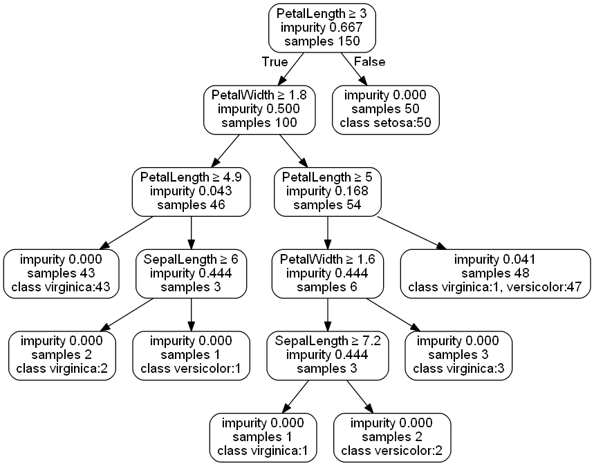

## CART For Decision Trees
This is a python implementation of the CART algorithm for decision trees based on Michael Dorner's code, https://github.com/michaeldorner/DecisionTrees.

##### Summary of code changes
1. Fixed a bug on lines 96 & 97 of the original code
2. Added the option to read feature names from a header line
3. Use the pydotplus package to generate a GraphViz dot script for the decision tree

##### Requirements
+ pydotplus: python interface to GraphVis dot language, http://pydotplus.readthedocs.io/index.html
+ GraphViz: to render the graphs, http://www.graphviz.org/

##### GraphViz plot of the classification tree for the Fisher irises data

